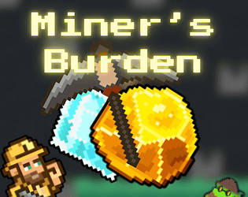
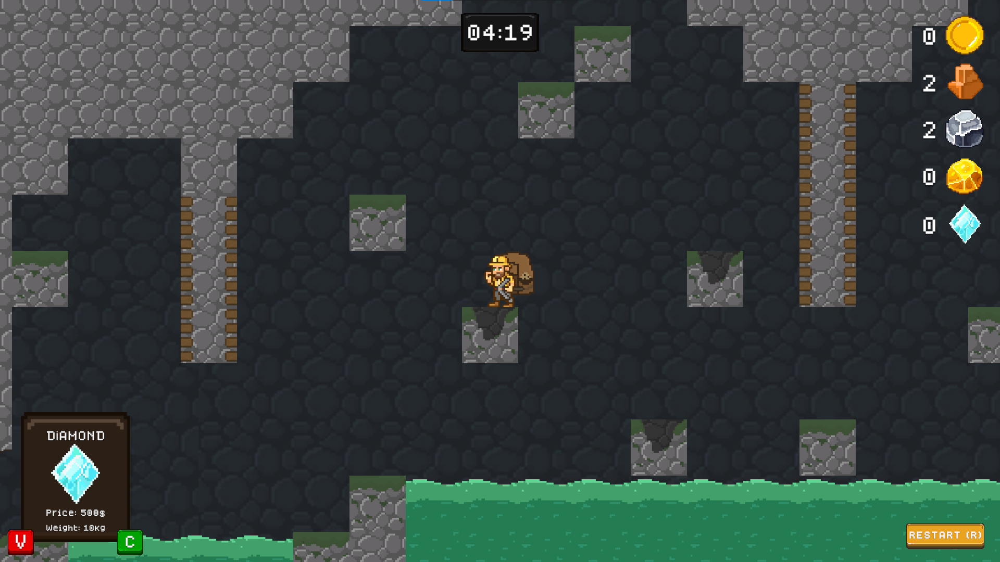

# Miner's Burden ⛏️

> **"Miner's Burden"**, Brackeys Game Jam (#14) kapsamında **72 saat** gibi kısıtlı bir sürede geliştirilmiş, 2D bir madencilik ve hayatta kalma oyunudur.

## 🎥 Oynanış Videosu
Videoyu izlemek için aşağıdaki görsele tıklayın:

## 🎮 Proje Hakkında ve Başarılar

Bu proje, kısıtlı zaman ve kaynak yönetimi altında tamamlanmış bir ekip çalışması ürünüdür. Oyun, yayınlandığı süreçte topluluktan yoğun ilgi görmüş ve **183 kişi tarafından oylanıp 146 yazılı geri bildirim** alarak yüksek bir etkileşim oranına ulaşmıştır.

* **Oynanabilir Demo:** [Itch.io Sayfası](https://burkan-aydin-games.itch.io/miners-burden)
* **Jam Değerlendirme Sayfası:** [Brackeys Jam Sonuçları](https://itch.io/jam/brackeys-14/rate/3851527)

## 👨‍💻 Rolüm ve Sorumluluklarım

**Pozisyon:** Lead Developer (Takım Lideri & Baş Geliştirici)
**Takım Yapısı:** 1 Geliştirici (Ben), Görsel Tasarımcı, Ses & Level Tasarımcıları.

Bu projede **tek programcı** olarak tüm oyun mekaniklerinin kodlanması, sistem mimarisinin kurulması ve proje yönetimini üstlendim. Başlıca sorumluluklarım:

* **Oyun Mimarisi:** Spagetti koddan kaçınarak, genişletilebilir ve modüler bir kod yapısı (OOP prensiplerine uygun) kurulması.
* **Mekanik Geliştirme:** Karakter kontrolcüsü, maden kazma mekanikleri, envanter sistemi ve fizik tabanlı etkileşimlerin programlanması.
* **UI/UX Programlama:** Menü sistemleri, oyun içi arayüzler ve geri bildirim sistemlerinin (feedback juice) entegrasyonu.
* **WebGL Optimizasyonu:** Oyunun tarayıcı üzerinde akıcı çalışması için bellek yönetimi ve build optimizasyonlarının yapılması.

## ⚙️ Teknik Detaylar ve Kullanılan Yapılar

Proje geliştirilirken temiz kod (clean code) prensiplerine dikkat edilmiştir.

* **Dil & Motor:** C#, Unity 2D
* **Tasarım Desenleri (Design Patterns):**
    * *Singleton:* GameManager ve AudioManager gibi global yöneticiler için.
    * *Observer (Events):* UI güncellemeleri ve oyun içi olayların (örneğin maden kırılması) tetiklenmesi için Action/Event yapısı kullanıldı.
* **Unity Özellikleri:**
    * Tilemap & Rule Tiles (Dinamik dünya tasarımı için)
    * ScriptableObjects (Item ve veri yönetimi için)
    * Legacy Input

**İletişim:** [Burkan Aydın Ağaçbüken] - [https://www.linkedin.com/in/burkan-aydin] - [burkanagacbuken8@gmail.com]
